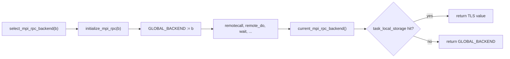
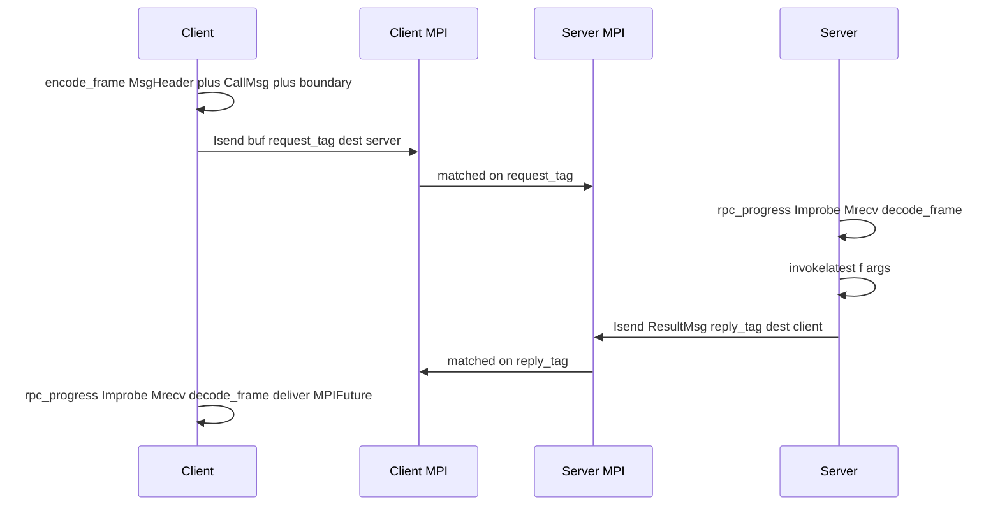

# MPIRPC.jl architecture

MPIRPC is a standalone, MPI-only RPC for Julia, modeled on two existing
designs:

* the **`Distributed` stdlib remote-call pipeline** — header + serialized body
  + boundary, `invokelatest` on the handler path, `RemoteException`-style
  error wrapping; and
* **Dagger.jl's "accelerate-once" backend selection** — one installed value
  determines the runtime semantics; the public API is identical regardless
  of mode.

There is no dependency on `Distributed` or `Dagger`. The transport is
[`MPI.jl`](https://github.com/JuliaParallel/MPI.jl); `Serialization` is the
only other (stdlib) dependency.

## 1. Module layout

| File | Role |
|------|------|
| [`src/MPIRPC.jl`](../src/MPIRPC.jl) | Module entry, exports. |
| [`src/protocol.jl`](../src/protocol.jl) | `MPIRRID`, `MsgHeader`, `CallMsg`, `CallWaitMsg`, `RemoteDoMsg`, `ResultMsg`, `RPCProgressHaltMsg`, frame encode/decode. |
| [`src/exceptions.jl`](../src/exceptions.jl) | `MPIRemoteException` and `run_work_thunk`. |
| [`src/config.jl`](../src/config.jl) | `AbstractMPIRPCBackend`, process-global + task-local installation, `select_mpi_rpc_backend!` / `with_mpi_rpc_backend` / `current_mpi_rpc_backend`. |
| [`src/refs.jl`](../src/refs.jl) | `MPIFuture` and waiter delivery primitives. |
| [`src/uniform.jl`](../src/uniform.jl) | `UniformMPIRPCBackend` — SPMD: every rank issues and services. |
| [`src/nonuniform.jl`](../src/nonuniform.jl) | `NonUniformMPIRPCBackend` — listener/client split. |
| [`src/remotecall.jl`](../src/remotecall.jl) | Public surface: `remotecall`, `remotecall_fetch`, `remotecall_wait`, `remote_do`, `bcast_remotecall`, `wait`/`fetch`. |
| [`src/progress.jl`](../src/progress.jl) | `rpc_progress!`, `rpc_progress_halt!`, `rpc_barrier`, `serve_listener`. |

## 2. Backend selection (Dagger parallel)

The selection model is a near-exact port of Dagger's
[`acceleration.jl`](../../Dagger.jl/src/acceleration.jl):

| Dagger | MPIRPC |
|--------|--------|
| `accelerate!(::Acceleration)` | `select_mpi_rpc_backend!(::AbstractMPIRPCBackend)` |
| `current_acceleration()` | `current_mpi_rpc_backend()` |
| `_with_default_acceleration(f)` | `with_mpi_rpc_backend(f, backend)` |
| `initialize_acceleration!(::Acceleration)` | `initialize_mpi_rpc!(::AbstractMPIRPCBackend)` |
| `Acceleration` | `AbstractMPIRPCBackend` |
| `DistributedAcceleration` (default no-op) | none — no backend is installed by default |
| `MPIAcceleration` | `UniformMPIRPCBackend`, `NonUniformMPIRPCBackend` |

The installed backend lives in **two slots**: a process-global `Ref` (set
once by `select_mpi_rpc_backend!`) and a task-local override
(`task_local_storage(:mpi_rpc_backend)`, layered by `with_mpi_rpc_backend`).
`current_mpi_rpc_backend()` checks the task-local slot first, falling back
to the global. This matches what Dagger users see in practice — Dagger
declares the `TaskLocalValue` but in practice every `@spawn`-ed task sees
the value because the package exposes a global initializer for the slot —
while keeping our public surface dependency-free.

**Re-init is not supported in v1.** Calling `select_mpi_rpc_backend!`
twice in the same process replaces the slot but does **not** finalize the
first backend's communicators or in-flight `Isend` buffers. To switch
modes mid-job, finalize MPI and start a fresh process.



## 3. Wire format

Every RPC message — request or reply — is a single MPI byte payload of the
form:

```
+--------------------------+--------------------------+----------------+
|   serialized MsgHeader   |   serialized AbstractMsg |  MSG_BOUNDARY  |
+--------------------------+--------------------------+----------------+
```

A fresh `Serialization.Serializer` is created per frame, so the
serializer's back-reference table is bounded to one frame. This is
deliberately simpler than `Distributed.ClusterSerializer`, which keeps
inter-message state for things like worker-ref caching. Full
`ClusterSerializer` parity (anonymous-function global-binding tracking,
shared object-number tables) is out of scope for v1 and is planned as an
opt-in serializer choice later.

The `MSG_BOUNDARY` (10 bytes) is preserved from Distributed's design
purely as a fail-fast protocol-version / corruption check; MPI is
message-oriented so we do not need the boundary for stream
re-synchronization.

### Message types

| Type | Direction | Effect |
|------|-----------|--------|
| `CallMsg{:call}` / `CallMsg{:call_fetch}` | client → server | Server runs `f(args...; kwargs...)`, replies with `ResultMsg(value_or_exception)`. |
| `CallWaitMsg` | client → server | Server runs the call; replies with `:OK` or an `MPIRemoteException`. |
| `RemoteDoMsg` | client → server | Server runs the call, no reply sent (fire-and-forget). |
| `ResultMsg` | server → client | Carries the value; routed to a `MPIFuture` via `MsgHeader.response_oid`. |
| `RPCProgressHaltMsg` | any → rank on `request_tag` | Control: `rpc_progress!` stops draining further requests in the current pass (`return false`); empty `MsgHeader`. |

### OID layout

`MPIRRID(whence::Int32, id::UInt64)` is our analog of `Distributed.RRID`,
with `whence` storing the *MPI rank* (within the backend's communicator)
that allocated the id. Each `remotecall*` allocates a fresh `MPIRRID` on
the caller, registers a `MPIFuture` in the backend's waiter table, and
puts the id in `MsgHeader.notify_oid`. The server echoes that id back in
`MsgHeader.response_oid` of the `ResultMsg`; the client routes the reply
to the matching future.

## 4. Tag layout (uniform & non-uniform)

Two disjoint tags carry **all** RPC traffic:

* `request_tag` (default `0xC0DE`): every `CallMsg` / `CallWaitMsg` /
  `RemoteDoMsg`, and control [`RPCProgressHaltMsg`](../src/protocol.jl)
  (see [`rpc_progress_halt!`](../src/progress.jl)) — same framing as RPC,
  consumed inside `rpc_progress!` without spawning a handler.
* `reply_tag`   (default `0xC0DF`): every `ResultMsg`.

Tags **do not encode call identity**. Concurrent calls between the same
pair of ranks are distinguished by `MPIRRID` in the header, not by tag.
This is the most important deadlock-avoidance choice in MPIRPC; see
section 5.



## 5. Deadlock avoidance and the ABBA argument

MPIRPC deliberately decouples three concerns that often get conflated in
hand-rolled MPI-RPC code:

1. **Direction** (request vs reply) — encoded in the *tag*.
2. **Call identity** (which call's reply is this?) — encoded in the
   `MPIRRID` carried in the *header*.
3. **Order of completion** — never derived from tag matching; only from
   waiter routing.

This decoupling immediately rules out a class of ABBA bugs:

* **Symmetric cross-calls.** If rank `i` issues a `remotecall_fetch` to
  rank `j` while rank `j` simultaneously issues one to rank `i`, no
  `(peer, tag)` pair is shared between request and reply traffic, so
  request `Improbe`s never accidentally match a reply or vice versa.
* **Many concurrent calls between one pair.** Two `remotecall`s from `i`
  to `j` get distinct `MPIRRID`s; the server's reply is routed by header
  rather than position in the queue, so the client correctly resolves
  futures even when fetched in a permuted order.
* **Wire-level FIFO.** MPI guarantees in-order delivery between a pair of
  ranks on a single tag; we rely on this for *delivery* of nested calls,
  e.g. a handler issuing further calls. **Handler execution is not
  serialized** — see §6 (threading model) — so an application that needs
  ordering of side effects across two messages from the same source
  must use `remotecall_wait` (or `remotecall` + `fetch`), not bare
  `remote_do` + `remotecall_fetch`.

### Mesh-shutdown deadlock and `rpc_barrier`

A subtler hazard appears specifically at *phase boundaries*: a rank `R`
whose own primary `remotecall_fetch` has just completed may still hold an
*unprocessed inbound request* sent by another rank from inside that
rank's handler. If `R` calls `MPI.Barrier` it stops pumping RPC
progress, and the peers still waiting on `R`'s replies hang.

[`rpc_barrier`](../src/progress.jl) addresses this with a non-blocking
`MPI.Ibarrier` whose completion is awaited *while every rank pumps*
[`rpc_progress!`](../src/progress.jl). Use it between phases of an SPMD
program and before exiting an RPC session. The
[uniform mpiexec suite](../test/uniform_mpiexec.jl) regression-tests the
exact pattern that motivated this primitive (the "nested re-entrant
remotecall_fetch" testset).

## 6. Threading model

MPIRPC supports `julia --threads=N` end-to-end: MPI is initialized with
`threadlevel=:multiple`, every MPI call is wrapped in a per-backend
`mpi_lock`, the OID counter is `Threads.Atomic{UInt64}`, and the waiter
table is guarded by `waiters_lock`. The two key design choices:

1.  **Handlers run on `Threads.@spawn`.** When `rpc_progress!` matches a
    request, it does not run the handler synchronously on the calling
    task — it spawns a fresh task whose body wraps the dispatch in
    `with_mpi_rpc_backend(backend) do ... end`. The progress pump
    returns immediately. The user closure runs without holding any
    MPIRPC lock.
2.  **No global progress lock.** Multiple threads may call
    `rpc_progress!` concurrently. The only serialization is the
    per-backend `mpi_lock` around individual MPI calls (`Improbe`,
    `Mrecv!`, `Isend`, `Test`, `Ibarrier`); state transitions on the
    waiter table use the separate `waiters_lock`.

Together these eliminate the deadlock pattern where a handler calls
`Threads.@spawn t; fetch(t)` and `t` itself does an MPIRPC call. With a
synchronous-handler model that held a progress lock, the spawned task
could not acquire the progress lock from another OS thread; the calling
task held it while blocked on `fetch(t)`. With handlers spawned, no lock
is held during user code, and `t` is free to drive progress on its own
task. The
[`uniform / handler that Threads.@spawn-then-fetches an RPC`](../test/uniform_mpiexec.jl)
regression test locks this in.

### Trade-off: handler execution is not FIFO

Distributed.jl serializes message dispatch through a single per-worker
reader task; this gives the property that two messages from the same
source on the same `(src, dest, tag)` are *executed* in arrival order.
MPIRPC under multi-threading does not provide that guarantee — it
preserves only **MPI delivery FIFO**. Two requests from rank `R` to rank
`P` may be matched and dispatched on different threads of `P`, in which
case the two handlers run concurrently and the second's side effects
may become visible before the first's.

The right primitive for "the next call must observe the previous call's
side effect" is `remotecall_wait`:

```julia
# Wrong under multi-threading: the fetch handler may dispatch on
# another thread *before* the remote_do handler's @eval commits.
remote_do(peer, ...) do; @eval Main.X = 42 end
val = remotecall_fetch(peer) do; Main.X end

# Right: remotecall_wait blocks the caller until the remote handler
# acknowledges completion, so the side effect is committed before the
# next message goes on the wire.
remotecall_wait(peer, ...) do; @eval Main.X = 42 end
val = remotecall_fetch(peer) do; Main.X end
```

The `set-then-read with remotecall_wait` testset in both mpiexec suites
documents this idiom.

### Hazards that remain (user-error class)

* `rpc_barrier` (and any MPI collective) must be called from at most one
  thread per rank — calling it concurrently posts multiple `Ibarrier`
  requests, which is incorrect by MPI semantics.
* User-level non-reentrant locks held across `remotecall_fetch` can
  self-deadlock if a remote handler running on the same task re-enters
  them. Use `ReentrantLock`, or do not take user locks from inside
  remote handlers.
* `wait(f::MPIFuture)` *under `daemon = false`* is a busy-pumping spin:
  every waiter calls `rpc_progress!` in a loop with `yield()` between
  passes. This is unavoidable in the no-daemon configuration because
  `wait` itself is the only progress driver — parking the caller would
  also park the wire. *Under `daemon = true`* the spin is replaced by a
  proper `Threads.Condition`-park (see "Cond-park under `daemon = true`"
  below), so this hazard only applies to applications that opted out of
  the daemon.

### Optional progress daemon

By default, every rank that needs to receive RPC must call
`rpc_progress!` (or block in `wait`/`fetch`/`rpc_barrier`/`serve_listener`,
each of which pumps progress internally). If that requirement is
inconvenient — for example, because the application's main loop is
already complex, or because a listener rank has long stretches of pure
computation — pass `daemon = true` to the backend constructor:

```julia
backend = select_mpi_rpc_backend!(
    UniformMPIRPCBackend(MPI.COMM_WORLD; daemon = true))
```

`select_mpi_rpc_backend!` then `Threads.@spawn`s a yield-only loop that
calls `rpc_progress!` in tight rotation until `shutdown!` flips
`backend.running[]` to `false`. `shutdown!` then `wait`s on the daemon
task before returning, so the caller can rely on no further MPI calls
being issued from the daemon after `shutdown!` returns.

The daemon never sleeps. This is a deliberate choice: a sleeping daemon
trades CPU for tail latency on inbound requests, and the same trade-off
is already available without a daemon (just don't enable it, and pump
progress on your own schedule). Enabling the daemon is a "consume one
OS thread, never wait on the wire" decision; if that is the wrong
trade-off for your workload, leave `daemon = false`.

#### Threadpool isolation

The daemon is spawned on Julia's `:interactive` threadpool when at
least one interactive thread is configured (`julia -t N,M` with
`M >= 1`). The interactive pool exists exactly for latency-sensitive
tasks that must not be starved by `:default`-pool work. Concretely,
this means: a CPU-bound user computation on a default-pool thread —
e.g. a tight numerical loop with no yield points, or a long `ccall`
to a synchronous C library — **cannot** prevent the daemon from
servicing inbound RPC. The `daemon survives CPU-bound default-pool
work` testset in
[`test/uniform_daemon_mpiexec.jl`](../test/uniform_daemon_mpiexec.jl)
locks this in: it saturates every default-pool thread with a
no-yield busy loop and asserts that a peer's `remotecall_fetch`
*to this rank* still completes promptly.

Handlers (`_run_handler_task`) deliberately stay on the `:default`
pool: handlers run user code, which is the workload the user wants
done; placing handlers on `:interactive` would steal latency budget
from whoever else uses that pool (the REPL, GC threads, etc.).

If `Threads.nthreads(:interactive) == 0` at `select_mpi_rpc_backend!`
time, the daemon falls back to `:default` and emits a one-shot `@info`
message naming the consequence. Existing application behavior is
preserved; isolation is opt-in via the launch flag.

Two regression suites exercise this path:
[`test/uniform_daemon_mpiexec.jl`](../test/uniform_daemon_mpiexec.jl)
and
[`test/nonuniform_daemon_mpiexec.jl`](../test/nonuniform_daemon_mpiexec.jl).
Neither calls `rpc_progress!` or `serve_listener` from user code, so
they are red unless the daemon is doing all of the inbound draining.

### Cond-park under `daemon = true`

`MPIFuture` carries a `Threads.Condition`. `deliver!` (called from
`_dispatch_reply!` after `take_waiter!` removes the future from the
waiter table) acquires the cond, stores the value atomically with
`@atomic :release`, and `notify(cond, all=true)` so any number of
waiters on the same future wake at once.

`wait(::MPIFuture)` reads `f.backend.daemon` and chooses one of two
paths:

```julia
function Base.wait(f::MPIFuture)
    isready(f) && return f
    backend = f.backend::AbstractMPIRPCBackend
    if backend.daemon
        @lock f.cond begin                  # check-park-recheck idiom
            while !isready(f)
                wait(f.cond)                # task fully descheduled
            end
        end
    else
        while !isready(f)                   # v1 spin: this task is the
            rpc_progress!(backend)          # only progress driver, so
            isready(f) && break             # parking would deadlock
            yield()
        end
    end
    return f
end
```

The check is on `f.backend.daemon`, not the currently-installed
backend, so a future created under a daemon-backed backend is still
park-cheap to wait on even from a task that has scoped a different
backend via `with_mpi_rpc_backend`.

**Lock geometry.** Three locks coexist on the reply path:

1. `backend.mpi_lock` — wraps the raw MPI calls in `_try_recv_one!`
   (`Improbe`, `Imrecv!`, `Test`). It is *released* between `Test`
   polls so the daemon's wait for a slow rendezvous receive does not
   block other threads' MPI calls.
2. `backend.waiters_lock` — wraps `take_waiter!`, the lookup that
   removes the future from the waiter table.
3. `f.cond` — wraps the value store and `notify` in `deliver!`, and
   the predicate check / `wait` in the consumer.

These are acquired strictly sequentially in `_dispatch_reply!`:
`mpi_lock` is released before `waiters_lock` is taken (the lookup
happens after the buffer is fully out of MPI), and `waiters_lock` is
released before `f.cond` is taken (`take_waiter!` returns the future,
then `deliver!` runs). At no point are two of them held at the same
time, so there is no cross-future or cross-rank ordering hazard.

**Wakeup atomicity.** `deliver!` and the consumer use the standard
condition-variable idiom: predicate (`isready`) is read inside the
lock, and `notify` happens *after* the predicate is set, *while
holding the same lock*. This prevents the lost-wakeup race where the
consumer's `isready` check observes `false` and parks just after the
producer's `notify` fired but before the producer's store became
visible.

### Non-blocking receive (`Imrecv!` + `Test`/`yield`)

`_try_recv_one!` does not call `MPI.Mrecv!`. The blocking
matched-receive primitive would have held `backend.mpi_lock` for the
entire duration of the message transfer, which for a large
rendezvous-protocol payload (multi-MB) can be milliseconds — during
which no other thread on the rank could acquire `mpi_lock` to do its
own MPI call (e.g. a handler trying to `Isend` a reply for a
different RPC).

Instead, `_try_recv_one!` runs in two phases:

1. **Match-and-post under `mpi_lock`.** `Improbe` matches the next
   message on the requested tag, the buffer is allocated to the
   matched count, and `Imrecv!` is posted. All three steps are
   atomic — they have to be, because the matched message handle is
   only valid until consumed by `Imrecv!`.

2. **Poll-and-yield without `mpi_lock`.** The non-blocking request
   from `Imrecv!` is then `Test`'d in a loop; `mpi_lock` is acquired
   only for the `Test` call itself (microseconds) and released before
   `yield()`. While the daemon's task is yielded, other threads can
   freely acquire `mpi_lock` and progress their own MPI work.

For typical RPC payloads under MPI's eager threshold (often 64 KiB on
OpenMPI, 256 KiB on MPICH), `Test` succeeds on the first poll because
the eager protocol delivered the entire payload during `Improbe`'s
match; the cost vs. blocking `Mrecv!` is one extra `Test` call and
one lock acquire/release pair, single-digit microseconds. For large
payloads on rendezvous, the daemon thread becomes truly cooperative
during the receive — yielding repeatedly until the transfer
completes — and other threads on the rank can issue their own MPI
calls in the gaps.

Combined with the threadpool isolation (daemon on `:interactive`),
this means the only places where a thread spends real wall time
inside MPI without yielding are `MPI.Init`, `MPI.Comm_dup`, and
`MPI.Finalize`, all of which are one-time startup or shutdown
events. **At runtime, no rank-level MPI call holds a thread without
yield.**

The `large concurrent payloads via Imrecv! + Test/yield` testset in
[`test/uniform_daemon_mpiexec.jl`](../test/uniform_daemon_mpiexec.jl)
exercises this path with multiple concurrent 1-MiB round-trips that
deliberately exceed common eager thresholds.

## 7. Uniform vs non-uniform — operational rules

| | Uniform | Non-uniform |
|---|---|---|
| Who initiates RPC? | Any rank | Any rank |
| Who services RPC? | All ranks | Only `listener_ranks` |
| Who must call `rpc_progress!`? | Every rank, regularly *(or none, if `daemon = true`)* | Listeners (for requests) and any rank with outstanding `MPIFuture`s (for replies). `wait`/`fetch` already pumps. *(Or no rank, if `daemon = true`.)* |
| `dest_rank` validity | Any peer in `comm` | Must be in `listener_ranks` |
| Subcomm by default | Yes (`MPI.Comm_dup`) | Yes (`MPI.Comm_dup`) |
| Phase barrier | `rpc_barrier(backend)` | `rpc_barrier(backend)` |
| World collectives | Run on `MPI.COMM_WORLD` independently | Same — the duped comm isolates RPC from world traffic |

### Collective safety in non-uniform mode

Because the backend duplicates the user's communicator, world-level
collectives (e.g. `MPI.Barrier(MPI.COMM_WORLD)`) cannot be matched against
RPC `Isend`s. Even so, **all ranks of `COMM_WORLD` must still participate
in any world collective**. The
[non-uniform mpiexec suite](../test/nonuniform_mpiexec.jl) explicitly
exercises a `MPI.Barrier(MPI.COMM_WORLD)` interleaved with subcomm RPC to
make sure the test does not encode a collective mismatch as "pass".

## 8. World-age and `invokelatest`

Where `Distributed/process_messages.jl` wraps the body deserializer in
`invokelatest(deserialize_msg, ...)` and the handler in
`invokelatest(msg.f, ...)`, MPIRPC does the same: see `decode_frame` in
[`protocol.jl`](../src/protocol.jl) and `_execute_request!` in
[`uniform.jl`](../src/uniform.jl). This lets remote ranks call functions
defined after their own world age has advanced (e.g. user code defined
between two RPC phases).

## 9. Mapping to Distributed (cheat sheet)

| Distributed | MPIRPC |
|---|---|
| `Future` | `MPIFuture` |
| `RRID(whence::Int, id::Int)` | `MPIRRID(whence::Int32, id::UInt64)` |
| `MsgHeader(response_oid, notify_oid)` | identical |
| `CallMsg{:call}`, `CallMsg{:call_fetch}`, `CallWaitMsg`, `RemoteDoMsg`, `ResultMsg` | identical names and roles |
| `MSG_BOUNDARY` (10 bytes) | `MSG_BOUNDARY` (10 bytes; different sentinel) |
| `ClusterSerializer` over a TCP stream | `Serializer` over a per-message `IOBuffer` |
| `invokelatest(deserialize_msg, ...)` | `invokelatest(deserialize, ...)` in `decode_frame` |
| `invokelatest(msg.f, msg.args...; ...)` in `handle_msg` | identical idiom in `_execute_request!` |
| `RemoteException` wrapping `CapturedException` | `MPIRemoteException` wrapping `CapturedException` |
| `remotecall` / `remotecall_fetch` / `remotecall_wait` / `remote_do` / `fetch` / `wait` | same names |

## 10. Security

Same model as `Distributed`: deserializing function objects and arguments
sent by peers is equivalent to letting them run code. Only run MPIRPC
across mutually trusted ranks.

## 11. What is intentionally not in v1

* No `ClusterSerializer`-equivalent global-binding propagation.
* No `RemoteChannel` (server-resident channel) — `MPIFuture` is the only
  reference type.
* No FIFO of *handler execution* across messages (only MPI delivery
  FIFO). See §6.
* No mid-process backend re-init.
* No transport other than `MPI.jl`.
* No retry / fault tolerance — a process death is fatal to outstanding
  futures targeting that rank, just as in `Distributed`.
